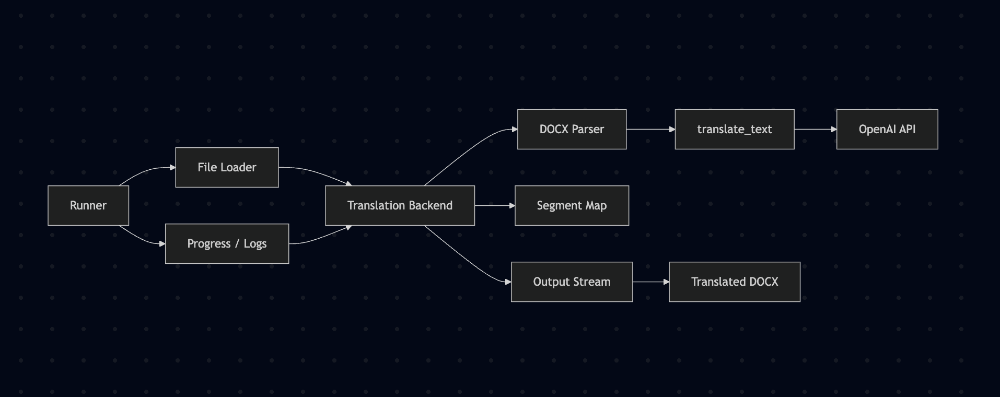

# Language Translation Tool


## Overview

This tool makes it easy to translate full documents like DOCX, PDF, and PPTX while keeping the original formatting and structure intact. It uses a flexible logic layer to understand what should be translated and how, working alongside language models to produce clean, editable outputs ready for use or refinement.

By automating repetitive tasks, this tool shifts the role of a manual translator to that of a **quality assurance specialist**, enabling **power users** to focus on refining outputs rather than starting from scratch. This approach significantly enhances both productivity and accuracy, making it possible to handle larger volumes of work with greater confidence.

At its core, the design is centered on two principles:
1. **Customizable Translation Logic**: A customizable system prompt governs how the tool handles names, technical terms, and domain-specific phrases. This flexibility ensures accurate and context-aware output to match nuanced need. 
2. **Human-Centered Document Interaction**: Instead of managing files through code or digging through folders, documents are surfaced directly in the interface. You can preview, translate, and export with just a few clicks.

### Key Components

## Docs Translation Workflow
Consier this basic workflow for a document translator in which you loop through pargraphs of text, extract text, send it to inference to an LLM and replace the original text with the translated text.



**What it does:**  
Runner → File Loader → Translation Backend → DOCX Parser → `translate_text()` (OpenAI) → Segment Map → Output Stream → Translated `.docx` (with Progress/Logs along the way).

**Formatting vs. styles:**
- ✅ Preserves **paragraph formatting**: headings, alignment, list structure (set on the paragraph).
- ⚠️ Drops **inline/run styles**: bold/italic/links, mixed fonts inside a sentence (runs are replaced).
- If you need inline styles preserved:
  1) *Quick but lossy:* translate each **run** separately (keeps styles; may hurt translation quality).
  2) *Best practice:* translate the **whole paragraph once**, then **diff/map** the result back to the original runs, copying their styles.
 
### Voice Translation Service

**Purpose:**  
Demonstrate live voice translation by taking a short mic recording, turning it into text, translating it, then having a text to speech model speak the translation back as an MP3.

**Entry Point:**  
`POST /api/voice_translate` (multipart/form-data)  
- `file`: recorded audio blob (e.g., `audio/webm;codecs=opus`)  
- `language`: target language code (e.g., `es`, `fr`, `de`, `zh`, …)

**Core Components:**  
- `TranslationBackend.translate_audio(bytes, target_language) -> (translated_text: str, mp3_bytes: bytes)`  
  1) **ASR (Whisper):** `whisper-1` transcribes the uploaded audio → `source_text`  
  2) **MT (GPT):** `translate_text()` → translates `source_text` to `target_language`  
  3) **TTS:** `tts-1` (voice=`nova`) synthesizes translated text → MP3 bytes  
- **HTTP layer (NiceGUI/FastAPI):** wraps the pipeline, returns MP3 with helpful headers.

**Response:**  
- **Body:** MP3 audio (translated speech)  
- **Headers:**  
  - `X-Original-Text`: short preview/safe snippet of transcription  
  - `X-Translated-Text`: label like “Translated to Spanish”  
  - `X-Target-Language`: target language code  
  - `Content-Length`: MP3 size in bytes

**Happy Path Flow:**  
1. Browser **MediaRecorder** captures audio → sends blob to `/api/voice_translate` with `language`.  
2. Backend calls `translate_audio()` → Whisper (ASR) → GPT translate → TTS MP3.  
3. Returns MP3; frontend sets `<audio src>` and displays original/translated text labels.

**Error Handling (high level):**  
- Empty upload → `400` with `X-Error`.  
- Any pipeline failure → `500` with `X-Error` message.  
- Backend logs at each stage (`[Backend]`, `[API]`) for diagnosis.

1. **TranslationBackend**
   - **Role**: Processes and translates text from the input documents.
   - **Features**:
     - Structured to handle multi-format inputs while preserving document integrity (e.g., layouts, fonts, tables).
     - Implements advanced parsing to isolate translatable elements while leaving non-essential elements untouched (e.g., URLs, metadata).
     - Context adaptation through fine-tuned language models ensures dialect-appropriate outputs.

2. **TranslationUI**
   - **Role**: Provides a clean, interactive interface for managing uploads, tracking progress, and reviewing translated outputs.
   - **Features**:
     - Tracks translation stages to provide transparency into the process.
     - Supports real-time feedback and correction workflows, allowing users to refine results with minimal friction.
     - Designed for accessibility and scalability across use cases.

Here’s the full Usage section in markdown for you to copy directly into your README.md:

## Usage

Follow these steps to set up and run the application:

1. **Clone the Repository**  
   Clone the project to your local machine:
   ```bash
   git clone https://github.com/dneish2/LanguageTranslation.git
   cd LanguageTranslation

	2.	Install Dependencies
Use the requirements.txt file to install the necessary Python modules:

pip install -r requirements.txt

	3.	Set Up Environment Variables
Ensure you have an .env file in the project root with your OpenAI API key:

OPENAI_API_KEY=your-api-key-here

	4.	Run the Application
Start the application by running the main script:

python TranslationUI.py

	5.	Access the Interface
Once the server starts, open your browser and navigate to:

http://127.0.0.1:8080

This will load the NiceGUI-based user interface, where you can upload documents, select target languages, and manage translations.

### Experimental Voice Translation
An additional page provides one-way voice translation using OpenAI's realtime API.
Click **Voice Translation (Exp)** in the top bar to access it. Record speech in any language and hear the translated output in your selected language.

### Prerequisites
- **Python Version**: Ensure Python 3.8 or higher is installed.
- **Dependencies**: Install all required packages listed in `requirements.txt`.
- **Environment Variables**: Add your OpenAI API key in a `.env` file located in the project root:
